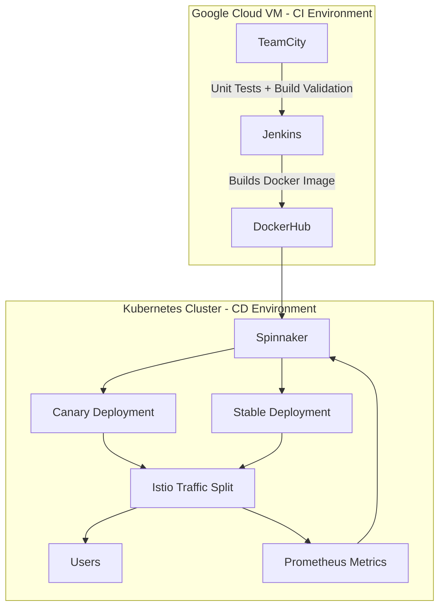
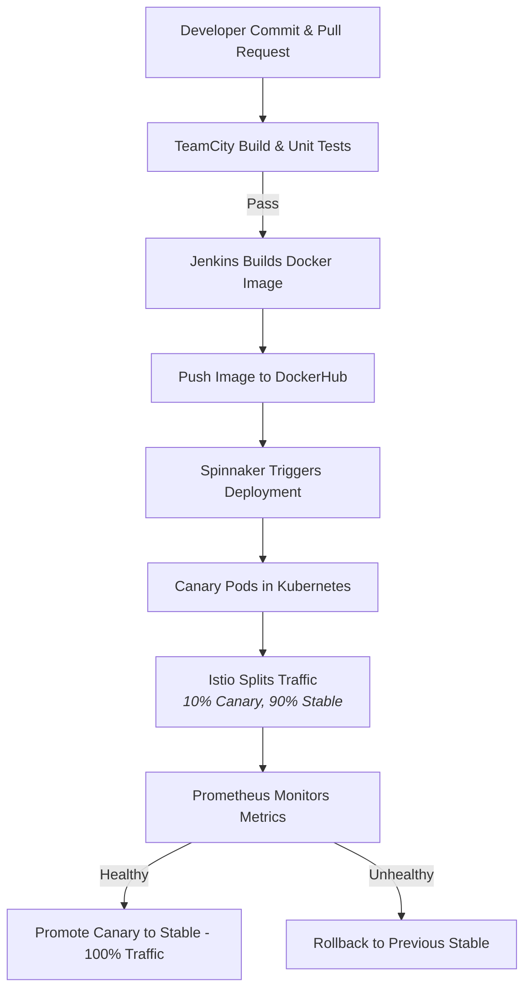

## Description of the Solution

Our team has developed a **CI/CD solution** that integrates four key tools across two distinct environments:

- **CI Environment (Google Cloud VM):**  
  Hosts **Jenkins** and **TeamCity** for source integration, build automation, and testing.  
- **CD Environment (Kubernetes Cluster):**  
  Runs **Spinnaker** for deployment orchestration and **Istio** for service mesh traffic management.  

This separation keeps production clean: builds and tests run outside the cluster, while deployments and traffic management stay inside Kubernetes.

The web application is a **Java-based project** (chosen because of its natural compatibility with TeamCity). It is containerized with Docker, versioned through GitHub, and deployed into Kubernetes.

## Deployment Strategy: Canary Release Model

The deployment strategy follows a **canary release model**:

- **Spinnaker** automates the rollout.  
- **Istio** handles traffic routing, initially directing a small percentage of user traffic (e.g., 10%) to the new canary release.  
- **Prometheus** collects real-time performance metrics (latency, error rates, pod health) and provides data for Automated Canary Analysis (ACA).  

If the canary passes health checks → Spinnaker promotes the new version to all users.  

If it fails → Spinnaker triggers an **automatic rollback** to the last stable version.  

This combination ensures safer deployments with reduced risk, high observability, and faster recovery.

---

## Architecture Diagram

## CI/CD Workflow Diagram

