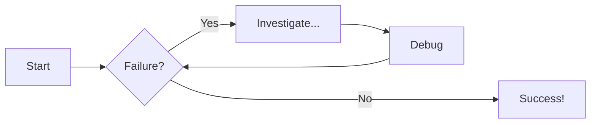
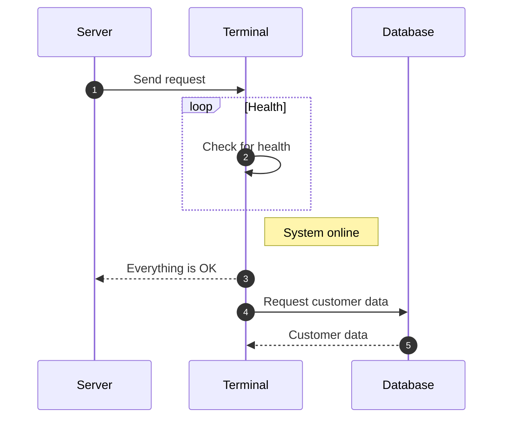

Our team has developed a **CI/CD solution** that integrates four key tools across two distinct environments:

- **CI Environment (Google Cloud VM):**  
  Hosts **Jenkins** and **TeamCity** for source integration, build automation, and testing.  
- **CD Environment (Kubernetes Cluster):**  
  Runs **Spinnaker** for deployment orchestration and **Istio** for service mesh traffic management.  

This separation keeps production clean: builds and tests run outside the cluster, while deployments and traffic management stay inside Kubernetes.
The web application is a **Java-based project** (chosen because of its natural compatibility with TeamCity). It is containerized with Docker, versioned through GitHub, and deployed into Kubernetes.
The deployment strategy follows a **canary release model**, where new versions are introduced to a small percentage of users before full rollout. Istio enables traffic splitting, while Spinnaker orchestrates the process.

---

## 🏗 Sample lang ni nga Diagram

## 🏗 Sample lang ni nga Diagram

